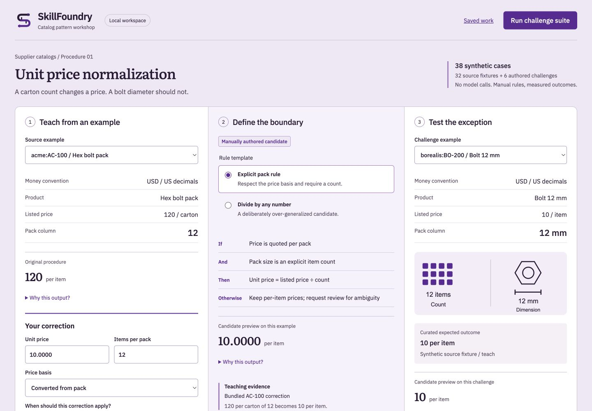

# SkillFoundry

Turn a human correction into a reusable, tested procedure.

A correction contains more than a preferred answer. It usually reveals a
missing condition: a unit, an exception, an authority rule, or a prerequisite.
SkillFoundry makes that condition explicit, then tests whether it generalizes
before anyone is allowed to publish it.

This repository includes the Milestone A execution core and a local teaching
workbench: a bounded slice of Milestone B. Save a correction, choose one of two
manual rule templates, test the complete synthetic suite, inspect regressions,
and reopen or export the saved evidence. No API key is needed.



## Run the workbench

Requires Python 3.11+, Node.js 20.19+ or 22.12+, and uv. Install dependencies
once; the application then runs locally without external services or model calls.

```bash
git clone https://github.com/Genious07/skillfoundry.git
cd skillfoundry
make install
make dev
```

Open **http://localhost:8020**. The API serves the compiled frontend and saves
work to `skillfoundry.db`. Stop it with Ctrl+C. Set `SKILLFOUNDRY_DB` to choose
another database location. Keep this unauthenticated prototype on localhost.

1. Start with **AC-100**: 120 per carton of 12. Save a unit price of 10, a pack
   count of 12, and the reason that conversion requires an explicit item count.
2. Select **Explicit pack rule**. The adjacent BO-200 challenge shows why a
   diameter of 12 mm must leave its per-item price of 10 unchanged.
3. Run the challenge suite. Read correct decisions alongside automatic coverage:
   38 correct decisions include seven appropriate requests for review.
4. Select **Divide by any number** and run again. Inspect the eight new critical
   errors and the blocked gate. Filter regressions and expand a saved trace.
5. Reopen an evaluation in **Saved work**, or export its evidence JSON. Refreshing
   the page keeps persisted history, but does not automatically select a run.
6. Try your own price and pack text in the scratchpad. It executes the selected
   rule without modifying the curated fixture labels.

Corrections are persisted evidence; they do not automatically rewrite a rule.
The templates are manually authored. Passing this demo gate does not publish a
procedure or establish accuracy on real supplier feeds.

See [audit findings](docs/audit.md), [design rationale](docs/design.md),
[local operations](docs/operations.md), and the [SVG brand kit](apps/web/public/brand).

## The problem, concretely

A catalog operations specialist normalizes supplier spreadsheets into one
product catalog. Supplier A quotes 120 per carton of 12. The correct unit price
is 10. A first draft procedure copies 120 straight through, and the catalog is
now wrong by a factor of twelve on every carton row.

The specialist corrects one row and explains why. The tempting generalization
is "divide the price by the number in the pack size column". That rule is
worse than the bug it fixes, because supplier B sells a **bolt 12 mm** priced
per item, and its pack size column also says `12 mm`. Applying the rule turns
a correct price of 10 into 0.8333.

The condition that actually matters is narrower than the correction looks:
divide only when the price is quoted per pack **and** the pack size is an
explicit count. When the price is per pack but the count is unknown, the right
answer is to decline and ask, not to guess.

## First successful outcome

```
$ skillfoundry run corrected --supplier acme
Unit price with explicit pack normalization  digest b94a262884f21fae
supplier acme  locale us  currency USD

sku       description                   listed unit     pack        unit price  outcome
---------------------------------------------------------------------------------------
AC-100    Hex bolt pack                    120 /carton  12             10.0000  per_unit_from_pack
AC-101    Washer pack                       60 /carton  24              2.5000  per_unit_from_pack
AC-102    Nut pack                          45 /carton  15              3.0000  per_unit_from_pack
AC-103    Anchor bolt                     8.50 /each    -                 8.50  as_listed
AC-104    Screw pack                     99.99 /carton  20              4.9995  per_unit_from_pack
AC-105    Rivet box                        150 /box     50              3.0000  per_unit_from_pack
AC-106    Spacer bundle                     72 /bundle  6              12.0000  per_unit_from_pack
AC-107    Threaded rod                   14.25 /item    -                14.25  as_listed
AC-108    Clip carton                      100 /carton  3              33.3333  per_unit_from_pack (rounded)
AC-109    Bracket case                     240 /case    16             15.0000  per_unit_from_pack
AC-110    Bolt carton unlabelled            45 /carton  -                    -  review: pack_size_not_explicit
AC-111    Grommet carton                    30 /carton  12 pk           2.5000  per_unit_from_pack
```

The same procedure on the supplier whose pack column holds dimensions:

```
$ skillfoundry run corrected --supplier borealis
BO-200    Bolt 12 mm                        10 /item    12 mm               10  as_listed
BO-204    Bolt pack 12 mm                  144 /carton  12             12.0000  per_unit_from_pack
BO-207    Pin 6 mm carton                   90 /carton  6 mm                 -  review: pack_size_not_explicit
```

Row BO-200 is priced per item, so the 12 mm is ignored. Row BO-204 is priced
per carton and its pack column holds a real count, so it converts. Row BO-207
is priced per carton but the pack column holds a diameter, so the item count is
unknown and the row is declined rather than guessed.

## Install

CLI-only installation requires Python 3.11 or newer. The CLI needs no database or API key. Network access is needed to install dependencies.

```bash
git clone https://github.com/Genious07/skillfoundry.git
cd skillfoundry
python3 -m venv .venv && .venv/bin/pip install -e ".[dev]"
.venv/bin/skillfoundry evaluate
```

## The measured result

Every number below comes from `skillfoundry evaluate` running over the bundled
fixtures, and every one is pinned by a test in
`tests/integration/test_end_to_end.py`.

```
$ skillfoundry evaluate
fixtures      fixtures/demo
case suite    32 synthetic source fixtures, 6 authored challenges
held out      10 source fixtures from suppliers ['corvid'], excluded from teaching; visible synthetic demo
taught        1 correction(s) from teaching.jsonl

Full synthetic suite, source fixtures and authored challenges together
procedure                           rows  correct  coverage  critical  abstain   fields
---------------------------------------------------------------------------------------
Baseline 1, original procedure        38  14/38        100%        24       0%      35%
Baseline 2, verbatim recall           38  15/38        100%        23       0%      39%
Candidate, explicit pack rule         38  38/38         82%         0      18%     100%
Candidate, over generalized           38  23/38        100%        15       0%      80%
```

Read that table with coverage next to accuracy. The candidate is correct on all
38 cases, and part of being correct is declining 7 of them. A procedure that
answered everything would score worse, not better: the over generalized
candidate has 100 percent coverage and 15 critical errors.

### The gate

```
Candidate, explicit pack rule  (procedure digest b94a262884f21fae)
Release gate: PUBLISHABLE

  [pass] Introduces no new critical unit errors on the full suite
         none introduced
  [pass] Every case reaches a defined terminal state
         no faults
  [pass] Positive paired performance against the original on supplier-held-out source fixtures
         fixed 6, broke 0 of 10 held out cases, exact two sided p=0.03125
  [pass] Generalizes beyond recalling the taught row
         fixed 23, broke 0 against verbatim recall over 38 cases, exact two sided p=2.384e-07
  [pass] Every regression against the original has been explicitly reviewed
         no unreviewed regressions

Candidate, over generalized  (procedure digest 4f166a9f99769aeb)
Release gate: BLOCKED

  [FAIL] Introduces no new critical unit errors on the full suite
         8 new critical cases: borealis:BO-200, borealis:BO-201, borealis:BO-202,
         borealis:BO-203, borealis:BO-205, borealis:BO-209, corvid:CO-303, gen:002
  [pass] Positive paired performance against the original on supplier-held-out source fixtures
         fixed 5, broke 1 of 10 held out cases, exact two sided p=0.2188
```

The over generalized candidate is the interesting one. It improves on the
holdout, with a positive net change of four cases. A single metric would have
shipped it. It is blocked because it introduces critical unit errors on rows
the original got right, and because acknowledging a regression cannot wave
through a critical unit error. That last property has its own test.

## The mechanism

### A procedure is data, not code

A procedure is a typed AST over eight operators: `read_field`, `parse_unit`,
`lookup`, `compare`, `branch`, `convert`, `emit`, `request_review`. Every
operator is implemented by trusted Python with declared input and output types.
There is no `eval` and no `exec`. A model may propose combinations of these
nodes and nothing else. Structural validation limits execution, but a valid rule
can still make incorrect decisions. The evaluation gate checks that separate risk.

Validation runs before execution and rejects: an operator outside the
procedure's declared allowed set, a read of a field not in the input schema, a
write to a field not in the output schema, an unresolved binding reference, an
undeclared lookup table, a capability beyond read only, and a procedure with no
`request_review` path at all. That last check matters: a procedure that cannot
decline is a procedure that will guess.

### Convert refuses rather than guesses

`convert` takes two parse outcomes and will only divide when both succeeded. A
procedure that tries to convert an ambiguous count does not produce a plausible
wrong price. It faults, the output row is discarded, and the case is recorded as
invalid. `tests/test_interpreter.py` builds exactly such an unguarded procedure
and asserts the fault.

### A count is not just a number

`12` is a count. `12 pk` and `12 ct` are counts. `12 mm`, `8 mm`, `3 kg`, `5 m`
and `2 in` are not, and neither is `0` or `assorted`. The parser refuses to
guess, and the refusal carries a reason a reviewer can read. Every unit in the
dimension vocabulary has a test asserting it is never read as a count.

### Money is exact

Prices are `Decimal` throughout. Adding `0.1` ten times in binary floating
point does not give `1.0`; there is a test that demonstrates the contrast. Unit
prices are quantized to four decimal places with half up rounding, and an
inexact division sets a `rounding_applied` flag rather than hiding it. `AC-108`
above shows it: 100 across a carton of 3 is 33.3333 and says so.

### The decimal convention is declared, never inferred

`1.234` is one thousand two hundred thirty four under European convention and
one point two three four under United States convention. There is no reliable
way to tell from the row, and guessing produces a thousandfold error, so the
convention is declared per supplier in `fixtures/demo/suppliers.json`. The
`corvid` feed uses European convention and there is a test that the same string
parses to different numbers under each.

### Branch conditions are mutually exclusive

Reading order never decides an outcome. Every branch condition in the library
is written to be disjoint, and a test cross products 10 price units against 10
pack sizes against 4 prices, 400 rows, and asserts that no row ever matches two
cases.

### Two baselines, not one

A candidate has to beat the original procedure **and** beat verbatim recall of
the taught correction. Without the second baseline, memorizing one row would
count as learning. Baseline 2 is a deterministic stand in for pasting the
correction into a prompt as plain text: it recalls the taught row perfectly and
falls back everywhere else. It does not bound the performance of an actual
prompted model. A measured model adapter replaces it in a later milestone. It is
labelled as a stand in in the code and it is not a language model.

### The holdout is a whole supplier

Splitting by random row would put near duplicate rows on both sides. The
`corvid` supplier is held out entirely, uses a different decimal convention, and
never appears in the teaching set. A test asserts that last part.

### Authored challenges stay separate from source fixtures

The 6 counterexamples in `cases/generated.jsonl` each carry a reviewer
rationale and are reported separately from source fixture numbers. A rule that only
satisfies its own counterexamples has not been shown to transfer.

## Commands

```bash
skillfoundry procedures                          # list and validate the library
skillfoundry show corrected --json               # plain language plus canonical AST
skillfoundry run corrected --supplier borealis   # run over one feed
skillfoundry explain corrected acme:AC-100       # field level evidence for one case
skillfoundry evaluate                            # both baselines, both candidates, the gate
```

`explain` is the evidence view. Each emitted field names the source columns and
the exact rule path that produced it:

```
$ skillfoundry explain corrected acme:AC-100
  unit_price  = 10.0000
               from price, pack_size
               rule body/0:branch/case2/2:emit
```

## Tests

```
$ pytest -q
162 passed

$ cd apps/web && npm test
4 passed
```

The suite covers the operator properties the product contract requires: unit
round trips, idempotent normalization, branch exclusivity, missing value
propagation, locale aware decimal parsing, and exact decimal arithmetic for
money. Grading is independent: no test asks a model whether it did well.

## Limitations

Read these before drawing conclusions from the numbers above.

- **The fixtures are synthetic and small.** 32 source fixtures across 3 invented
  suppliers, hand labelled by the author. The 38 out of 38 result describes this
  fixture set and nothing else. It is not evidence that the rule works on a real
  supplier feed, and it is not a benchmark.
- **The statistics are honest but underpowered.** The holdout comparison rests
  on 6 discordant pairs, p equals 0.0312. That is a real exact test, not an
  approximation, but 10 held out cases cannot establish transfer. Sample size is
  printed next to every p value for that reason.
- **There is no rule proposer yet.** All three procedures in the library are
  hand authored. The AST, the capability checks, and the validator exist so a
  model can propose safely, but no model proposes anything in this milestone.
  The claim being tested here is that the evaluation harness can tell a good
  candidate from a plausible bad one, not that a model can write either.
- **Baseline 2 is not a language model.** It is a deterministic verbatim recall
  stand in, described above. A model with the correction in its prompt might do
  better or worse.
- **The domain is one transformation.** Unit normalization for catalog prices.
  Field extraction, mapping lookup, and conditional transformation are in the
  operator set but only unit normalization is exercised end to end.
- **Local prototype, not a team service.** The frontend and FastAPI API persist
  corrections and evaluation snapshots in SQLite. There is no authentication,
  organization ownership, worker queue, model proposer, arbitrary file import,
  editable rule AST, or production publishing. Evaluations are synchronous and
  bounded to the bundled suite. See [limits](docs/limits.md).
- **The gate uses positive net improvement, not a significance threshold.** The
  exact paired p-value is reported as evidence, not used as proof of transfer.
- **The critical error threshold is a judgement.** A unit price wrong by a
  factor of 2 or more is classified critical because the smallest real pack is
  two. A price wrong by 1.5x is graded as an ordinary wrong value. That boundary
  is a product decision, it is documented in `metrics.py`, and it has a test.

## Repository layout

```
packages/domain/          product rules: units, AST, validation, interpreter, library
packages/evaluation/      independent metrics, splits, baselines, gate
packages/cli/             offline command line interface
services/api/            local FastAPI API and SQLite persistence
apps/web/                React teaching workbench and original SVG assets
fixtures/demo/            3 synthetic suppliers, hand labelled cases, taught correction
tests/                    property tests and the end to end suite
docs/                     architecture and the limits of what is measured
```

`services/worker` and `deploy` remain future work. This source checkout is the
supported installation layout; a standalone wheel with embedded fixtures is not
yet provided.

## Licence

MIT. The fixtures are synthetic and redistributable. Suppliers, SKUs, and
prices are invented.
